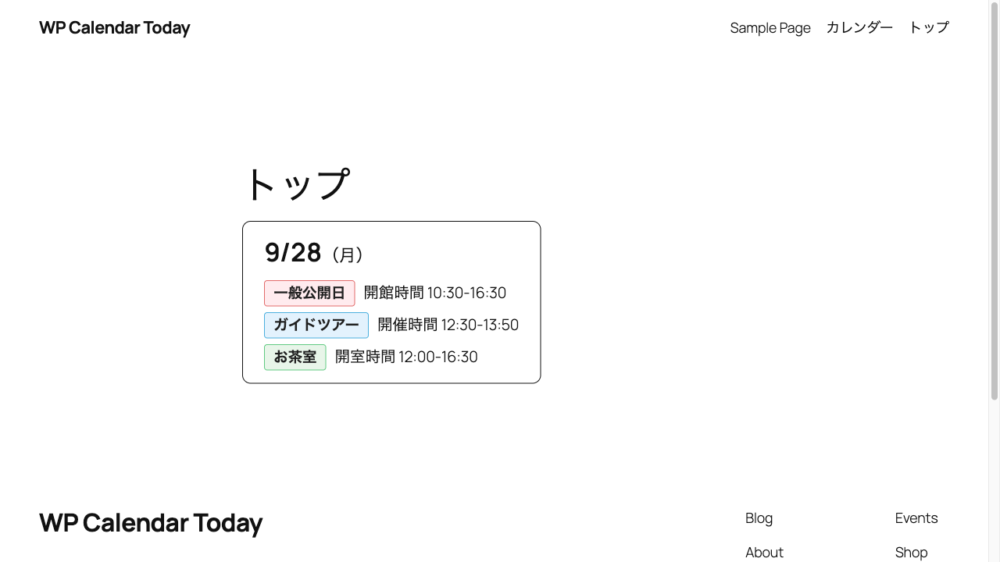

# WP Calendar Today

カレンダープラグイン「[Event Calendar Maker](https://wordpress-plugin.8bit.co.jp/calendar/)」に登録した今日の予定を、トップページなどに小さなバッジで表示する WordPress プラグインです。



バッジには今日の日付と曜日、その日の予定が並びます。
予定名はカレンダーで付けたラベルの色で表示され、説明があればその後ろに出ます。
バッジ全体を、月間カレンダーのページへのリンクにできます。

## 必要なもの

- WordPress 6.5 以上
- PHP 8.1 以上
- Event Calendar Maker（無料版でも有料版でも動きます）

## インストール

1. [Releases](https://github.com/noguchi/wp-calendar-today-plugin/releases) から `wp-calendar-today-plugin.zip` をダウンロードします。
2. 管理画面の「プラグイン」>「新規プラグインを追加」>「プラグインのアップロード」で ZIP を選び、インストールします。
3. 「有効化」を押します。

Event Calendar Maker が有効になっていないと、管理画面に注意が出ます。

## 使い方

### 1. カレンダーと予定を登録する

Event Calendar Maker の管理画面でカレンダーを作り、予定を登録します。
このとき、カレンダーの「フィールド名」を控えておきます（例：`pocevents`）。

予定の項目は、次のように表示されます。

| 項目 | 表示 |
| --- | --- |
| イベント名 | ラベルの文字 |
| イベントラベルの色 | ラベルの色 |
| 説明 | ラベルの後ろに、登録した文字のまま |

たとえば「開館時間 10:00 – 18:00」と出したいときは、説明にそのまま書きます。

### 2. ページにショートコードを置く

バッジを出したいページの本文に、「ショートコード」ブロックで次を書きます。
`hash` にはカレンダーのフィールド名を入れます。

```
[today_schedule hash="pocevents" link="/calendar/"]
```

- **hash**：カレンダーのフィールド名。必須です。
- **link**：バッジを押したときの移動先。省略すると、バッジはリンクになりません。
- **limit**：バッジに並べる予定の数。省略すると全部並べます。数を書くと、その数まで並べて、超えた分は「ほか N 件」と出ます。

月間カレンダーのページは、別の固定ページに Event Calendar Maker の埋め込みタグ（`{{limited-calendar-フィールド名}}`）を「カスタム HTML」ブロックで置いて作り、その URL を `link` に書きます。

### 3. 表示を確かめる

ページを開くと、今日の日付とその日の予定が出ます。
予定のない日は、日付と曜日だけが出ます。
祝日は曜日に「祝」が付きます（例：`9/21（月・祝）`）。

予定を登録してから表示に反映されるまで、数秒かかることがあります。

## 表示を自分の HTML に変える

ショートコードを開始タグと終了タグで囲み、その間に HTML を書くと、その HTML で表示します。
`{year}` のような書き方の場所に、今日の値が入ります。
この場合は「ショートコード」ブロックではなく、「カスタム HTML」ブロックに書きます。

```html
[today_schedule hash="pocevents" limit="3"]
<div class="my-today">
  <time datetime="{date}">{year}年{month}月{day}日（{weekday}{holiday}・祝{/holiday}）</time>
  {has_events}<ul>
    {events}<li class="label-{event_color}">{event_name} {event_description}</li>{/events}
  </ul>{/has_events}
  {no_events}<p>本日の予定はありません</p>{/no_events}
  <a href="/calendar/">カレンダーを見る</a>
</div>
[/today_schedule]
```

使える名前の一覧と細かい規則は `docs/spec.md` の「テンプレート」の節にあります。
色付きのラベルと開館時間を並べた例が `docs/samples/top-museum.html` にあります。

## うまく表示されないとき

- **何も出ない**：管理者でログインしてそのページを開くと、原因が表示されます。フィールド名の書き間違いか、Event Calendar Maker が有効になっていないことがほとんどです。閲覧者にはこの表示は出ません。
- **登録した予定が出ない**：予定の日付が今日（サイトの「タイムゾーン」設定での今日）になっているか確かめてください。
- **Event Calendar Maker のメニューが出ない**：Event Calendar Maker を一度無効化してから有効化し直してください。

## 不具合と要望

[Issues](https://github.com/noguchi/wp-calendar-today-plugin/issues) へお願いします。

## ライセンス

GPL-2.0-or-later（[LICENSE](LICENSE)）
